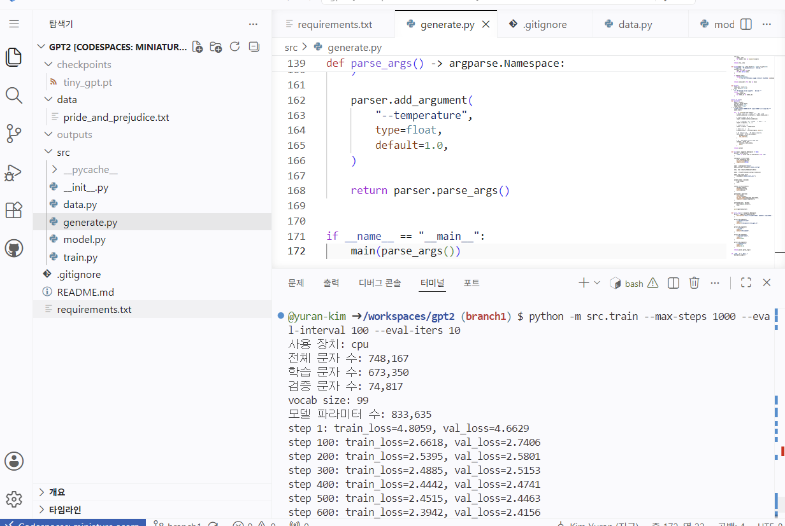
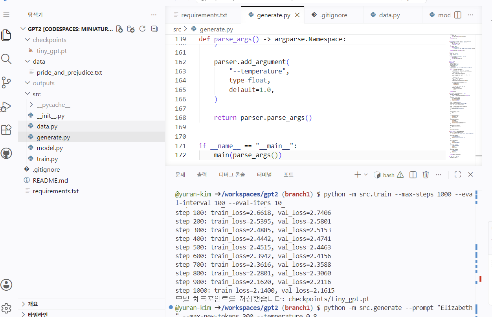
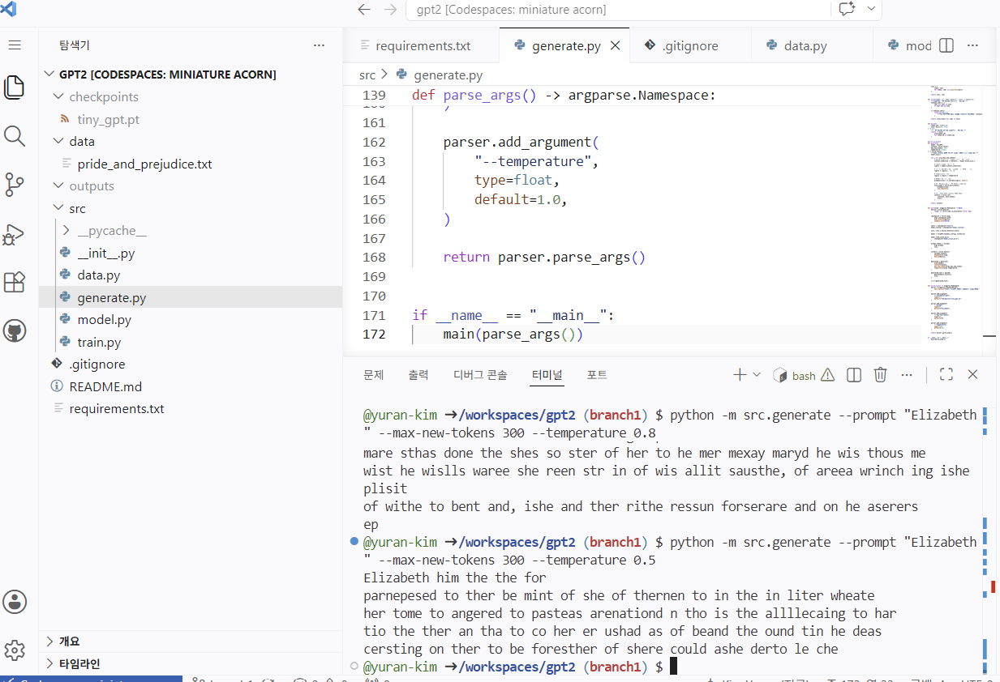
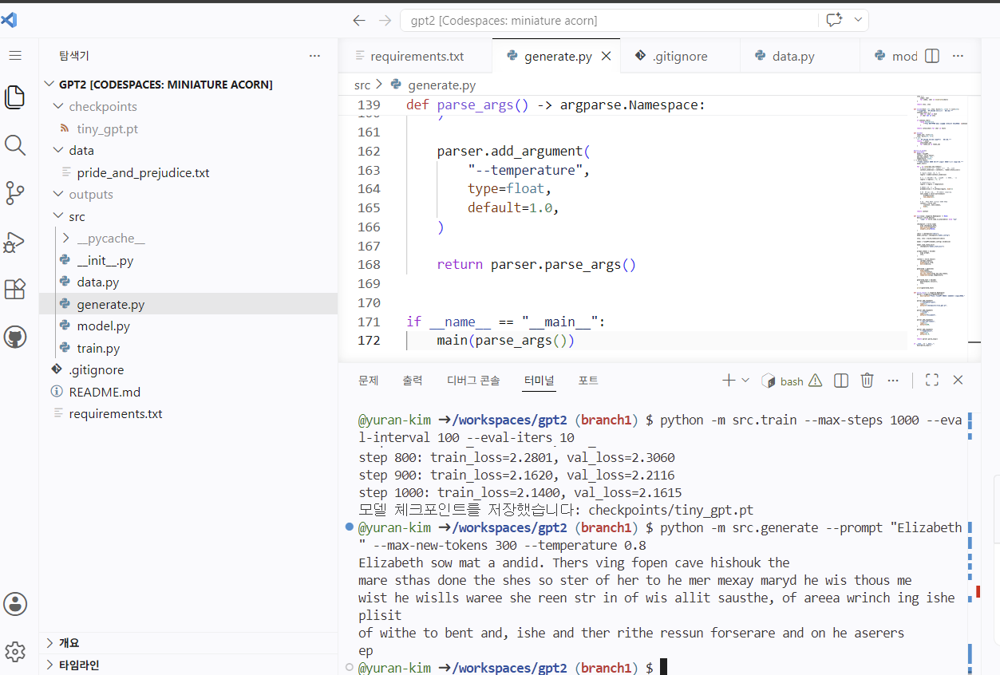
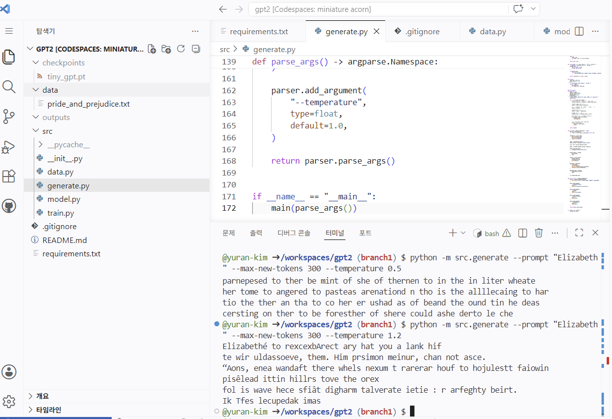

# Character-Level TinyGPT

## 1. 프로젝트 소개

이 프로젝트는 문자 단위 텍스트 데이터를 이용하여 GPT 계열 언어 모델의 핵심 구조를 직접 구현한 프로젝트입니다.

학습 데이터로 Jane Austen의 소설 *Pride and Prejudice*를 사용하였으며, 이전 문자들을 바탕으로 다음 문자를 예측하도록 모델을 학습했습니다.

본 프로젝트는 OpenAI의 공식 GPT-2 모델 전체를 그대로 재현한 것이 아닙니다. GPT 계열 언어 모델의 핵심 원리를 이해하기 위해 다음 요소를 직접 구현한 문자 단위 TinyGPT 모델입니다.

* Character-level tokenization
* Token embedding
* Positional embedding
* Masked self-attention
* Multi-head attention
* Feed-forward network
* Residual connection
* Layer normalization
* Transformer block
* Autoregressive text generation

---

## 2. 프로젝트 목표

이 프로젝트의 목표는 완성된 GPT 모델을 라이브러리에서 불러와 사용하는 것이 아니라, GPT의 내부 구조와 학습 과정을 직접 구현하고 이해하는 것입니다.

구체적인 목표는 다음과 같습니다.

1. 텍스트를 문자 단위 토큰으로 변환하기
2. 입력 시퀀스와 다음 문자 정답 시퀀스를 만들기
3. Masked self-attention을 이용하여 미래 토큰을 가리기
4. Multi-head attention을 이용하여 다양한 문맥 정보를 처리하기
5. Residual connection과 LayerNorm이 포함된 Transformer block 구현하기
6. Cross-entropy loss를 이용하여 다음 문자 예측 모델 학습하기
7. 학습된 모델을 체크포인트로 저장하고 다시 불러오기
8. 프롬프트 뒤에 문자를 하나씩 생성하는 autoregressive generation 구현하기
9. Temperature에 따른 생성 결과의 차이 확인하기

---

## 3. 사용 데이터

학습 데이터로 Project Gutenberg에서 제공하는 Jane Austen의 *Pride and Prejudice* 원문을 사용했습니다.

* 작품명: *Pride and Prejudice*
* 저자: Jane Austen
* 파일 형식: TXT
* 전체 문자 수: 748,167
* 학습 문자 수: 673,350
* 검증 문자 수: 74,817
* Vocabulary size: 99

데이터 주소:

```text
https://www.gutenberg.org/cache/epub/1342/pg1342.txt
```

이 프로젝트는 단어 단위가 아닌 문자 단위 언어 모델입니다.

예를 들어 다음 문자열은:

```text
Elizabeth
```

다음과 같은 문자 토큰으로 처리됩니다.

```text
'E', 'l', 'i', 'z', 'a', 'b', 'e', 't', 'h'
```

영문 알파벳뿐 아니라 공백, 줄바꿈, 숫자, 문장부호 등 학습 데이터에 등장하는 모든 고유 문자가 각각 하나의 토큰이 됩니다.

---

## 4. 프로젝트 구조

```text
gpt2/
├── data/
│   └── pride_and_prejudice.txt
├── docs/
│   └── images/
│       ├── training_progress.png
│       ├── training_complete.png
│       ├── generation_temperature_05.png
│       ├── generation_temperature_08.png
│       └── generation_temperature_12.png
├── src/
│   ├── __init__.py
│   ├── data.py
│   ├── model.py
│   ├── train.py
│   └── generate.py
├── checkpoints/
│   └── tiny_gpt.pt
├── outputs/
├── requirements.txt
├── .gitignore
└── README.md
```

각 파일의 역할은 다음과 같습니다.

| 파일                 | 역할                                                                                |
| ------------------ | --------------------------------------------------------------------------------- |
| `src/data.py`      | 텍스트 로딩, 문자 단위 토큰화, 입력과 정답 시퀀스 생성                                                  |
| `src/model.py`     | Attention Head, Multi-head Attention, Feed Forward, Transformer Block, TinyGPT 구현 |
| `src/train.py`     | 학습·검증 데이터 분리, mini-batch 학습, 손실 계산, 체크포인트 저장                                      |
| `src/generate.py`  | 체크포인트 로딩, prompt 인코딩, autoregressive text generation                              |
| `requirements.txt` | 프로그램 실행에 필요한 Python 패키지                                                           |
| `.gitignore`       | 체크포인트, 출력 파일, 캐시 파일 등 Git에서 제외할 항목 설정                                             |
| `README.md`        | 프로젝트 설명, 실행 방법과 실험 결과 정리                                                          |

---

## 5. 데이터 처리 방식

전체 텍스트에 등장하는 고유 문자를 정렬하여 vocabulary를 생성합니다.

```python
chars = sorted(set(text))
```

각 문자와 정수 인덱스의 대응 관계를 만듭니다.

```python
self.stoi = {
    char: index
    for index, char in enumerate(chars)
}

self.itos = {
    index: char
    for char, index in self.stoi.items()
}
```

* `stoi`: string to integer
* `itos`: integer to string

문자열은 모델에 입력하기 전에 정수 토큰으로 변환되고, 생성된 정수 토큰은 다시 문자로 복원됩니다.

### 입력과 정답 시퀀스

모델은 현재까지의 문자를 이용하여 다음 문자를 예측하도록 학습합니다.

예를 들어 원문이 다음과 같고:

```text
hello
```

`block_size=4`라면 입력과 정답은 다음과 같습니다.

```text
입력 x: h e l l
정답 y: e l l o
```

정답 시퀀스는 입력 시퀀스를 한 칸 오른쪽으로 이동한 형태입니다.

따라서 모델은 입력 시퀀스의 각 위치에서 다음 문자를 예측합니다.

---

## 6. 모델 구조

모델의 전체 흐름은 다음과 같습니다.

```text
Token IDs
    ↓
Token Embedding
    +
Position Embedding
    ↓
Transformer Blocks
    ↓
Final LayerNorm
    ↓
Language Model Head
    ↓
Logits
```

기본 모델 설정은 다음과 같습니다.

| 설정                           |       값 |
| ---------------------------- | ------: |
| Block size                   |     128 |
| Batch size                   |      32 |
| Embedding dimension          |     128 |
| Number of attention heads    |       4 |
| Number of Transformer blocks |       4 |
| Dropout                      |     0.1 |
| Learning rate                |  0.0003 |
| Model parameters             | 833,635 |

### 입력 및 출력 shape

모델 입력의 shape은 다음과 같습니다.

```text
(B, T)
```

* `B`: batch size
* `T`: sequence length

Embedding 이후의 shape은 다음과 같습니다.

```text
(B, T, C)
```

* `C`: embedding dimension

최종 logits의 shape은 다음과 같습니다.

```text
(B, T, V)
```

* `V`: vocabulary size

각 batch의 각 문자 위치마다 vocabulary에 포함된 모든 다음 문자 후보의 점수를 출력합니다.

---

## 7. Masked Self-Attention

Attention Head에서는 입력을 Key, Query, Value로 변환합니다.

```python
k = self.key(x)
q = self.query(x)
v = self.value(x)
```

Query와 Key의 내적을 통해 각 토큰 사이의 관련도를 계산합니다.

```python
weights = q @ k.transpose(-2, -1)
```

그 후 head dimension의 제곱근을 이용하여 scaling합니다.

```python
weights = weights * (k.size(-1) ** -0.5)
```

GPT는 다음 문자를 예측할 때 미래의 문자를 미리 보면 안 되므로 causal mask를 적용합니다.

```text
1 0 0 0
1 1 0 0
1 1 1 0
1 1 1 1
```

각 위치는 자기 자신과 이전 위치만 참고할 수 있습니다.

```python
weights = weights.masked_fill(
    self.tril[:T, :T] == 0,
    float("-inf"),
)
```

이후 softmax를 적용하여 attention weight를 계산하고, 이를 Value에 곱합니다.

```python
weights = F.softmax(weights, dim=-1)
output = weights @ v
```

---

## 8. Multi-Head Attention

여러 개의 Attention Head를 병렬로 실행한 뒤 결과를 마지막 차원에서 연결합니다.

```python
output = torch.cat(
    [head(x) for head in self.heads],
    dim=-1,
)
```

각 Head는 학습 과정에서 서로 다른 문자 관계나 문맥 정보를 학습할 수 있습니다.

Head별 역할은 미리 지정하지 않으며, 학습 과정에서 자동으로 결정됩니다.

---

## 9. Feed Forward Network

Attention이 여러 토큰 사이의 정보를 전달하는 역할을 한다면, Feed Forward Network는 각 토큰의 표현을 개별적으로 가공합니다.

```python
self.network = nn.Sequential(
    nn.Linear(emb_dim, 4 * emb_dim),
    nn.ReLU(),
    nn.Linear(4 * emb_dim, emb_dim),
    nn.Dropout(dropout),
)
```

Embedding dimension을 일시적으로 네 배 확장한 후 다시 원래 크기로 줄입니다.

```text
128 → 512 → 128
```

---

## 10. Transformer Block

한 개의 Transformer Block은 다음 순서로 구성됩니다.

```text
LayerNorm
→ Multi-Head Attention
→ Residual Connection
→ LayerNorm
→ Feed Forward
→ Residual Connection
```

코드에서는 다음과 같이 구현했습니다.

```python
x = x + self.self_attention(self.layer_norm1(x))
x = x + self.feed_forward(self.layer_norm2(x))
```

Residual connection은 기존 입력 정보를 유지하면서 새롭게 계산된 결과를 더하는 역할을 합니다.

---

## 11. 설치 방법

### 11.1 저장소 복제

```bash
git clone <repository-url>
cd gpt2
```

`<repository-url>`에는 이 GitHub 저장소의 URL을 입력합니다.

### 11.2 패키지 설치

```bash
pip install -r requirements.txt
```

`requirements.txt`에는 다음 패키지가 포함되어 있습니다.

```text
torch
numpy
```

### 11.3 데이터 다운로드

저장소에 데이터 파일이 포함되어 있지 않은 경우 다음 명령어로 다운로드할 수 있습니다.

```bash
mkdir -p data
wget "https://www.gutenberg.org/cache/epub/1342/pg1342.txt" -O data/pride_and_prejudice.txt
```

`wget`을 사용할 수 없는 환경에서는 다음 명령어를 사용합니다.

```bash
mkdir -p data
curl -L "https://www.gutenberg.org/cache/epub/1342/pg1342.txt" -o data/pride_and_prejudice.txt
```

---

## 12. 프로그램 실행 위치

모든 명령어는 프로젝트 최상위 폴더에서 실행해야 합니다.

프로젝트 최상위 폴더는 다음 파일과 폴더가 함께 보이는 위치입니다.

```text
data/
docs/
src/
README.md
requirements.txt
```

현재 위치는 다음 명령어로 확인할 수 있습니다.

```bash
pwd
ls
```

Python package import가 정상적으로 작동하도록 모듈 방식으로 실행합니다.

```bash
python -m src.train
```

다음 방식으로는 실행하지 않습니다.

```bash
python src/train.py
```

---

## 13. 짧은 학습 테스트

전체 학습 전에 프로그램이 정상적으로 실행되는지 5 step만 학습하여 확인할 수 있습니다.

```bash
python -m src.train --max-steps 5 --eval-interval 5 --eval-iters 2
```

실행 결과 예시는 다음과 같습니다.

```text
사용 장치: cpu
전체 문자 수: 748,167
학습 문자 수: 673,350
검증 문자 수: 74,817
vocab size: 99
모델 파라미터 수: 833,635
step 1: train_loss=4.8059, val_loss=4.6307
step 5: train_loss=4.1599, val_loss=4.0684
모델 체크포인트를 저장했습니다: checkpoints/tiny_gpt.pt
```

5 step 학습은 전체 학습 파이프라인이 정상적으로 작동하는지 확인하기 위한 테스트입니다.

학습량이 매우 적기 때문에 이 상태에서 생성한 결과는 무작위 문자에 가깝게 나타납니다.

---

## 14. 1000 Step 학습

다음 명령어로 모델을 1000 step 학습합니다.

```bash
python -m src.train --max-steps 1000 --eval-interval 100 --eval-iters 10
```

각 옵션의 의미는 다음과 같습니다.

| 옵션                | 설명                         |
| ----------------- | -------------------------- |
| `--max-steps`     | 모델 parameter를 업데이트할 전체 횟수  |
| `--eval-interval` | 학습 및 검증 손실을 출력할 간격         |
| `--eval-iters`    | 검증 손실 계산에 사용할 mini-batch 수 |

1000 step은 전체 데이터셋을 1000번 학습하는 1000 epoch를 의미하지 않습니다.

한 step은 mini-batch 하나를 이용하여 다음 과정을 한 번 수행하는 것을 의미합니다.

```text
Forward
→ Loss 계산
→ Backpropagation
→ Parameter Update
```

따라서 1000 step은 모델 parameter가 1000번 업데이트되었다는 뜻입니다.

### 14.1 학습 진행 화면

아래 화면은 학습 초반부터 중간까지의 손실 변화입니다.



### 14.2 학습 완료 화면

아래 화면은 1000 step 학습이 완료되고 체크포인트가 저장된 결과입니다.



1000 step 학습 결과는 다음과 같습니다.

```text
step 100: train_loss=2.6618, val_loss=2.7406
step 200: train_loss=2.5395, val_loss=2.5801
step 300: train_loss=2.4885, val_loss=2.5153
step 400: train_loss=2.4442, val_loss=2.4741
step 500: train_loss=2.4515, val_loss=2.4463
step 600: train_loss=2.3942, val_loss=2.4156
step 700: train_loss=2.3616, val_loss=2.3588
step 800: train_loss=2.2801, val_loss=2.3060
step 900: train_loss=2.1620, val_loss=2.2116
step 1000: train_loss=2.1400, val_loss=2.1615
```

학습 초기에 비해 train loss와 validation loss가 모두 감소했습니다.

이는 모델이 문자 간의 관계와 영어 텍스트의 통계적 패턴을 학습하고 있음을 보여줍니다.

학습이 완료되면 다음 경로에 체크포인트가 저장됩니다.

```text
checkpoints/tiny_gpt.pt
```

---

## 15. 텍스트 생성

학습된 모델을 이용하여 다음과 같이 텍스트를 생성할 수 있습니다.

```bash
python -m src.generate --prompt "Elizabeth" --max-new-tokens 300 --temperature 0.8
```

각 옵션의 의미는 다음과 같습니다.

| 옵션                  | 설명                          |
| ------------------- | --------------------------- |
| `--prompt`          | 텍스트 생성을 시작할 문자열             |
| `--max-new-tokens`  | 새로 생성할 문자 수                 |
| `--temperature`     | 다음 문자를 선택할 때 확률 분포의 다양성을 조절 |
| `--checkpoint-path` | 불러올 체크포인트 파일 경로             |

기본 체크포인트 경로는 다음과 같습니다.

```text
checkpoints/tiny_gpt.pt
```

텍스트 생성은 다음 과정을 반복합니다.

```text
Prompt 입력
→ 모델이 다음 문자에 대한 logits 계산
→ 마지막 위치의 logits 선택
→ Softmax로 확률 변환
→ Multinomial sampling으로 다음 문자 선택
→ 선택한 문자를 기존 context 뒤에 추가
→ 다시 모델에 입력
→ 반복
```

이 방식을 autoregressive generation이라고 합니다.

---

## 16. Temperature 비교 실험

Temperature는 생성 단계에서 logits를 softmax에 입력하기 전에 나누는 값입니다.

```python
logits = logits / temperature
probabilities = F.softmax(logits, dim=-1)
```

Temperature는 모델의 학습 parameter를 변경하지 않습니다.

동일한 체크포인트를 사용하면서 다음 문자를 선택하는 확률 분포만 변경합니다.

### 16.1 Temperature 0.5

실행 명령어:

```bash
python -m src.generate --prompt "Elizabeth" --max-new-tokens 300 --temperature 0.5
```

실행 결과:



Temperature가 1보다 작으면 높은 logit과 낮은 logit 사이의 차이가 커집니다.

따라서 높은 확률의 문자가 더 자주 선택되며, 결과가 상대적으로 안정적입니다. 다만 표현이 반복되거나 다양성이 줄어들 수 있습니다.

---

### 16.2 Temperature 0.8

실행 명령어:

```bash
python -m src.generate --prompt "Elizabeth" --max-new-tokens 300 --temperature 0.8
```

실행 결과:



Temperature 0.8에서는 높은 확률의 문자를 어느 정도 우선하면서도 일정한 다양성을 유지합니다.

생성 결과에서는 공백, 줄바꿈, 문장부호와 영어 단어와 유사한 문자 조합이 나타났습니다.

생성 결과 예시:

```text
Elizabeth sow mat a andid. Thers ving fopen cave hishouk the
mare sthas done the shes so ster of her to he mer mexay maryd he wis thous me
wist he wislls waree she reen str in of wis allit sausthe, of areea wrinch ing ishe
plisit of withe to bent and, ishe and ther rithe ressun forserare and on he aserers
ep
```

---

### 16.3 Temperature 1.2

실행 명령어:

```bash
python -m src.generate --prompt "Elizabeth" --max-new-tokens 300 --temperature 1.2
```

실행 결과:



Temperature가 1보다 크면 logits 사이의 차이가 줄어들어 확률 분포가 평평해집니다.

따라서 낮은 확률의 문자도 선택될 가능성이 커집니다. 결과의 다양성은 증가하지만, 불규칙한 철자와 문장부호도 더 많이 나타날 수 있습니다.

---

## 17. Temperature 비교 결과

| Temperature | 결과 특징                                |
| ----------: | ------------------------------------ |
|       `0.5` | 높은 확률의 문자를 강하게 선호하여 안정적이지만 반복적일 수 있음 |
|       `0.8` | 안정성과 다양성 사이의 균형                      |
|       `1.0` | 모델이 계산한 기본 확률 분포 사용                  |
|       `1.2` | 다양성은 증가하지만 잘못된 철자와 불규칙한 표현도 증가       |

낮은 temperature는 모델의 선택을 보수적으로 만들고, 높은 temperature는 더 다양한 선택을 가능하게 합니다.

---

## 18. 입력값 오류 처리

생성 프로그램에는 잘못된 입력으로 인해 이해하기 어려운 오류가 발생하는 것을 막기 위해 입력값 검사 기능을 추가했습니다.

### 18.1 빈 prompt 검사

```python
if not args.prompt:
    raise ValueError(
        "prompt는 한 글자 이상 입력해야 합니다."
    )
```

빈 prompt는 입력 sequence의 길이가 0이 되기 때문에 허용하지 않습니다.

### 18.2 음수 max-new-tokens 검사

```python
if args.max_new_tokens < 0:
    raise ValueError(
        "max_new_tokens는 0 이상의 정수여야 합니다."
    )
```

새로 생성할 문자 수는 음수가 될 수 없으므로 미리 검사합니다.

### 18.3 0 이하의 temperature 검사

```python
if args.temperature <= 0:
    raise ValueError(
        "temperature는 0보다 커야 합니다."
    )
```

Temperature는 다음 계산에서 나누는 값으로 사용되기 때문에 반드시 0보다 커야 합니다.

```python
logits = logits / temperature
```

---

## 19. 학습 결과 해석

5 step 학습 후에는 다음과 같이 특수문자와 알파벳이 무작위에 가깝게 생성되었습니다.

```text
Elizabethn_Tx1je 9e*h2cjOnBicmDa...
```

1000 step 학습 후에는 다음과 같이 영어 문장과 비슷한 형태가 나타났습니다.

```text
Elizabeth sow mat a andid. Thers ving fopen...
```

아직 완전한 영어 단어나 문법적으로 정확한 문장을 생성하지는 못하지만, 다음 요소를 학습한 것을 확인할 수 있습니다.

* 문자 출현 빈도
* 문자 사이의 연결 관계
* 영어 단어와 유사한 철자 구조
* 공백과 줄바꿈
* 문장부호 사용
* 단어 길이와 문장 길이의 패턴

이는 train loss와 validation loss의 감소가 실제 생성 결과의 변화로 이어졌음을 보여줍니다.

---

## 20. 프로젝트의 한계

### 20.1 문자 단위 토큰화

단어 또는 subword 단위가 아니라 문자 단위로 학습하기 때문에 단어와 긴 의미 구조를 학습하는 데 많은 학습량이 필요합니다.

### 20.2 작은 모델 크기

이 모델의 parameter 수는 약 83만 개로 실제 GPT-2보다 매우 작습니다.

따라서 복잡한 문법과 긴 문맥을 학습하는 데 한계가 있습니다.

### 20.3 제한된 학습 데이터

한 권의 소설만 이용했기 때문에 다양한 주제와 문체를 학습하지 못했습니다.

### 20.4 제한된 학습 횟수

1000 step만 학습했기 때문에 영어 철자와 문장 구조를 완전히 학습하기에는 부족합니다.


---

## 21. 결론

이 프로젝트에서는 문자 단위 데이터를 이용하여 GPT 계열 언어 모델의 핵심 구조를 직접 구현했습니다.

텍스트를 정수 토큰으로 변환하고, token embedding과 position embedding을 더한 뒤, masked multi-head self-attention과 feed-forward network로 구성된 Transformer block을 통과시켰습니다.

모델은 각 문자 위치에서 다음 문자를 예측하도록 cross-entropy loss를 이용해 학습했습니다.

5 step 학습에서는 무작위에 가까운 문자가 생성되었지만, 1000 step 학습 후에는 영어의 공백, 단어 길이, 자주 사용되는 문자 조합, 줄바꿈과 문장부호 패턴이 나타났습니다.

또한 동일한 체크포인트에서 temperature를 0.5, 0.8, 1.2로 변경하여 생성 결과의 안정성과 다양성이 달라지는 것을 확인했습니다.

이를 통해 GPT 계열 언어 모델이 전체 문장을 한 번에 생성하는 것이 아니라, 이전까지의 문맥을 바탕으로 다음 토큰의 확률을 계산하고 하나씩 반복하여 생성한다는 원리를 확인할 수 있었습니다.